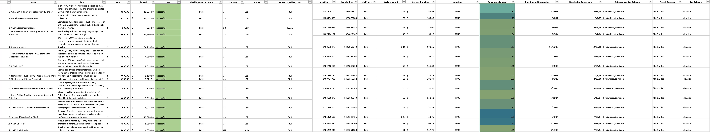

# Excel Homework
This project is part of the Data Analytics and Visualization Bootcamp at Washington University. 

## Project Intro/Objective
Over $2 billion has been raised using the massively successful crowdfunding service, Kickstarter, but not every project has found success. Of the more than 300,000 projects launched on Kickstarter, only a third have made it through the funding process with a positive outcome.

Getting funded on Kickstarter requires meeting or exceeding the project's initial goal, so many organizations spend months looking through past projects in an attempt to discover some trick for finding success. For this week's homework, you will organize and analyze a database of 4,000 past projects in order to uncover any hidden trends

### Methods Used
* Infereential Statistics
* Excel Spreadsheet Manipulation
* Data Visualization

### Technologies
* Excel

## Kickstarter Questions

Three conclusions that I can make based on the data: Audience based entertainment sees more activity than any other industry (music, theater, film), and therefore more successful campaigns numerically. The end of the year is a bad time to start a kickstarter campaign. You are much less likely to succeed. Mainstream ventures tend to be more successful than less popular, more specialized sub categories (i.e. plays, rock music, and movie dramas vs. world music, translations, and food trucks.

There are some limitations on the data. Since the total platform has over 300,000 campaigns, the 4,000 looked at here represent just over 1% of the total data available. It is possible that the data set is not indicative of the overall Kickstarter campaign experience. A larger data set would reduce that doubt. The data set also does not take into account the established branding power and marketing acumen of the applicant. If they are already established in some way, and are just needing more money to expand, or have an aggressive campaign to drive investors, they are more likely to be successful than a true startup with limited resources or marketing experience to attract donors.

Some possible other charts to look at would be a pivot table using the initial goal amount- does the amount of money that the business is asking for effect the success rate? Are smaller dollar requests more successful than larger ones? Where is the sweet spot? You could also look at a chart examining the success rate based on countries- where is Kickstarter more successful? You could also do a chart to compare which effects the success rate more- a higher average donation, or the total number of donors? That could help you target your potential investor pool.

Vizualizations:

Bonus Questions

The median is a better representation of the data. The outliers are all on the high side, making the mean artificially high. There is more variation in the successful. This does make sense- the failed ones had less overall interest, so the number of backers would be lower.

(Provide more detailed overview of the project.  Talk a bit about your data sources and what questions and hypothesis you are exploring. What specific data analysis/visualization and modelling work are you using to solve the problem? What blockers and challenges are you facing?  Feel free to number or bullet point things here)

